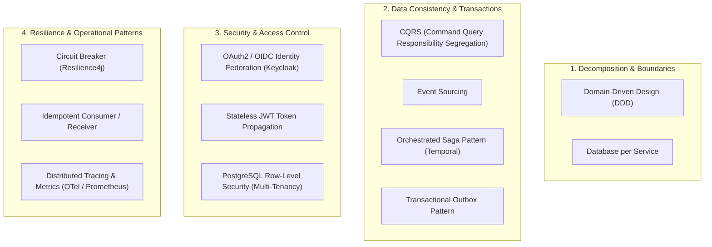

# Microservices Architectural & Design Patterns in CineBook

This document provides an exhaustive, production-grade technical breakdown of the **Microservices Architectural & Design Patterns** implemented across the **CineBook** ticketing platform.

---

## 🏛️ Executive Summary of Patterns

The **CineBook** platform is engineered using modern Cloud-Native & Microservices Architecture standards to achieve high concurrency, fault tolerance, strict auditability, and multi-tenant security:

---

## 📦 Detailed Breakdown of Architectural Patterns

### 1. Decomposition & Domain Boundary Patterns

#### 1.1 Domain-Driven Design (DDD) Bounded Contexts
* **Concept**: Decouples the monolith into domain-aligned microservices where each service owns a specific domain context.
* **CineBook Implementation**:
  * [`user-management-service`](file:///d:/Development/CineBook_Development/user-management-service): Manages user identity, tenant organization setups, and Keycloak roles.
  * [`booking-service`](file:///d:/Development/CineBook_Development/booking-service): Manages booking aggregates, ticket state transitions, and CQRS projections.
  * [`cinema-service`](file:///d:/Development/CineBook_Development/cinema-service): Manages theaters, screens, seat layouts, and showtime schedules.
  * [`location-service`](file:///d:/Development/CineBook_Development/location-service): Manages regions, cities, and physical cinema address metadata.
  * [`payment-service`](file:///d:/Development/CineBook_Development/payment-service): Manages payment processing, gateway integration (Razorpay), and refunds.
  * [`notification-service`](file:///d:/Development/CineBook_Development/notification-service): Manages transactional email and SMS delivery.

#### 1.2 Database per Service Pattern
* **Concept**: Prevents tight data-layer coupling by ensuring each microservice exclusively owns its datastore. Microservices never directly access another service's tables.
* **CineBook Implementation**:
  * Each service runs against its own distinct database schema:
    * `cinebook_user_db` $\rightarrow$ `user-management-service`
    * `cinebook_booking_db` $\rightarrow$ `booking-service`
    * `cinebook_cinema_db` $\rightarrow$ `cinema-service`
    * `cinebook_location_db` $\rightarrow$ `location-service`
    * `cinebook_payment_db` $\rightarrow$ `payment-service`
    * `cinebook_notification_db` $\rightarrow$ `notification-service`

---

### 2. Integration & Data Consistency Patterns

#### 2.1 CQRS (Command Query Responsibility Segregation)
* **Concept**: Separates read and write operations into distinct models, optimizing write throughput and query performance independently.
* **CineBook Implementation**:
  * **Command Side (Write)**: Writes transactional domain commands to `public.domain_event_entry` via Axon Framework in [`booking-service`](file:///d:/Development/CineBook_Development/booking-service). Zero row-locking on read views during high-concurrency ticket sales.
  * **Query Side (Read)**: Asynchronous projection engine ([`BookingProjection.java`](file:///d:/Development/CineBook_Development/booking-service/src/main/java/com/cinebook/bookingservice/projection/BookingProjection.java)) updates `booking_read.booking` for instant query fetches (`GET /api/v1/bookings/history`).

#### 2.2 Event Sourcing Pattern
* **Concept**: Persists application state changes as an append-only, immutable event log rather than overwriting database rows.
* **CineBook Implementation**:
  * Axon stores domain events (`BookingCreatedEvent`, `BookingConfirmedEvent`, `BookingCancelledEvent`) inside `public.domain_event_entry`.
  * Enables complete transaction auditability and historical state replayability.

#### 2.3 Orchestrated Saga Pattern
* **Concept**: Coordinates distributed multi-service transactions using a central orchestrator that issues commands and handles rollback compensations if any step fails.
* **CineBook Implementation**:
  * **Orchestrator**: **Temporal Workflow Engine** (`BookingWorkflowImpl`).
  * **Steps**:
    1. **Reserve Seat** $\rightarrow$ `seat-commands`
    2. **Charge Payment** $\rightarrow$ `payment-commands`
    3. **Confirm Booking & Send Ticket** $\rightarrow$ `booking-commands` / `notification-commands`
  * **Compensations**: If payment fails, Temporal automatically executes compensating activities (`releaseSeat` command via Kafka).

#### 2.4 Transactional Outbox Pattern
* **Concept**: Avoids dual-write issues (writing to a DB and publishing to Kafka in separate un-atomic steps) by persisting outbound messages into an Outbox table within the same DB transaction.
* **CineBook Implementation**:
  * [`payment-service`](file:///d:/Development/CineBook_Development/payment-service) writes event payloads to `PaymentOutboxEvent` repository within the primary transaction. A background publisher polls the outbox and publishes events reliably to Kafka.

#### 2.5 Event-Driven Architecture (EDA) & Schema Registry
* **Concept**: Services communicate asynchronously over Kafka event streams using strongly-typed, schema-validated messages.
* **CineBook Implementation**:
  * **Kafka / Redpanda Broker**: Manages event topics (`booking-events`, `seat-events`, `payment-events`, etc.).
  * **Apicurio Schema Registry**: Validates Avro binary message schemas compiled from [`cinebook-common-messaging`](file:///d:/Development/CineBook_Development/cinebook-common-messaging).

---

### 3. Security & Access Control Patterns

#### 3.1 OAuth2 / OpenID Connect (OIDC) Identity Federation
* **Concept**: Centralizes authentication and token generation into an identity provider.
* **CineBook Implementation**:
  * **Keycloak IDP** (v24, Realm `cinebook` on `:8080`) handles registration, user logins, password resets, and realm roles (`USER`, `THEATER_ADMIN`, `PLATFORM_ADMIN`).

#### 3.2 Stateless JWT Bearer Token Propagation
* **Concept**: Requests carry signed JWT access tokens containing user claims, roles, and tenant scopes.
* **CineBook Implementation**:
  * All Spring Boot microservices enforce security via `spring-boot-starter-oauth2-resource-server`, decoding and validating incoming JWT signatures statelessly.

#### 3.3 Multi-Tenant Row-Level Security (RLS)
* **Concept**: Enforces data isolation between cinema organizations directly at the database layer.
* **CineBook Implementation**:
  * Requests propagate `x-tenant-id` headers. PostgreSQL schemas enforce tenant isolation via SQL policy: `tenant_id = current_setting('app.tenant_id', true)`.

---

### 4. Resilience & Operational Patterns

#### 4.1 Circuit Breaker Pattern
* **Concept**: Prevents cascading failures when a downstream microservice or third-party dependency is struggling or unavailable.
* **CineBook Implementation**:
  * Resilience4j `@CircuitBreaker(name = "keycloakAdmin")` guards Keycloak calls in [`KeycloakAdminClientService.java`](file:///d:/Development/CineBook_Development/user-management-service/src/main/java/com/cinebook/usermanagementservice/service/KeycloakAdminClientService.java).

#### 4.2 Idempotent Consumer / Receiver Pattern
* **Concept**: Guarantees that duplicate command messages or network retries do not result in duplicate state changes or double charges.
* **CineBook Implementation**:
  * [`PaymentService.java`](file:///d:/Development/CineBook_Development/payment-service/src/main/java/com/cinebook/paymentservice/service/PaymentService.java) uses unique `bookingId` keys to idempotently process payment charges and refunds via Razorpay API.

#### 4.3 Distributed Tracing & Observability
* **Concept**: Tracks end-to-end user request execution paths across multiple asynchronous microservices.
* **CineBook Implementation**:
  * **OpenTelemetry Collector** (`otel-collector-config.yaml`) captures trace contexts across Kafka events and HTTP calls.
  * **Prometheus & Grafana**: Collects and visualizes real-time metric streams from Spring Boot Actuator.

---

## 📊 Summary Matrix of Architectural Patterns

| Pattern Category | Pattern Name | Key Component / Service | Technology Stack | Primary Architectural Benefit |
| :--- | :--- | :--- | :--- | :--- |
| **Decomposition** | Domain-Driven Design (DDD) | All Microservices | Java 21, Spring Boot | Modular business boundaries & team autonomy |
| | Database per Service | All Microservices | PostgreSQL (Separate DBs) | Zero database coupling across microservice layers |
| **Consistency** | CQRS | [`booking-service`](file:///d:/Development/CineBook_Development/booking-service) | Axon Framework 4.x, PostgreSQL | Unlocks high read/write scalability & eliminates locking |
| | Event Sourcing | [`booking-service`](file:///d:/Development/CineBook_Development/booking-service) | Axon Event Store (`domain_event_entry`) | Complete transaction audit trail and state rehydration |
| | Orchestrated Saga | `saga-orchestrator` | **Temporal Engine** (`:7233`) | Multi-service distributed transactions & compensating rollbacks |
| | Transactional Outbox | [`payment-service`](file:///d:/Development/CineBook_Development/payment-service) | JPA Outbox Repository + Kafka | Guarantees atomic DB writes and reliable event emission |
| | Event-Driven Messaging | All Microservices | Redpanda / Kafka (`:9092`), Apicurio (`:8081`) | Asynchronous, loose coupling via Avro-validated streams |
| **Security** | Identity Federation (OIDC) | [`user-management-service`](file:///d:/Development/CineBook_Development/user-management-service) | Keycloak 24 (`:8080`) | Centralized user authentication & RBAC management |
| | Stateless JWT Propagation | All Microservices | Spring OAuth2 Resource Server | Lightweight, scalable API access control |
| | Multi-Tenant RLS | PostgreSQL Schemas | PostgreSQL Row-Level Security | Hardened multi-tenant data isolation at the DB level |
| **Resilience** | Circuit Breaker | [`user-management-service`](file:///d:/Development/CineBook_Development/user-management-service) | Resilience4j | Prevents cascading service failures |
| | Idempotent Consumer | [`payment-service`](file:///d:/Development/CineBook_Development/payment-service) | Razorpay SDK, Booking UUIDs | Prevents duplicate card charges during network retries |
| | Distributed Tracing | Infrastructure | OpenTelemetry, Prometheus, Grafana | E2E visibility and debugging across microservice spans |
