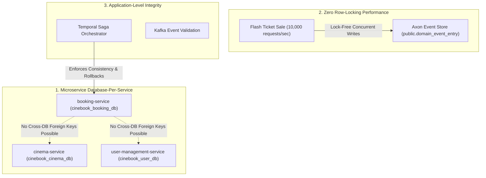

# Database Relationship & Foreign Key Analysis in CineBook

This document provides a granular technical analysis of the **Database Relationship Architecture** in the **CineBook** ticketing platform, detailing the intentional exclusion of physical SQL Foreign Key (FK) constraints and the implementation of logical application-level references.

---

## 🎯 Executive Findings Summary

* **Physical Foreign Key Constraints (`FOREIGN KEY ... REFERENCES ...`)**: **`0`** (None).
* **JPA Relational Annotations (`@ManyToOne`, `@OneToMany`, `@JoinColumn`, `@ManyToMany`)**: **`0`** (None).
* **Relationship Implementation**: Handled exclusively via **Logical Foreign Keys** (primitive scalar IDs: `Long`, `String` UUIDs) enforced at the application, Saga workflow, and Kafka event layers.

---

## 🏛️ Granular Entity-by-Entity Relationship Mapping

Below is a detailed audit of every JPA entity across CineBook microservices, illustrating how relationships are represented using scalar fields rather than physical database foreign keys:

### 1. 🎟️ `booking-service`
*Database Schema*: `cinebook_booking_db` (Write: `public`, Read: `booking_read`)

| JPA Entity File | Scalar Identifier Field | Logical Target Entity & Service | Entity Code Snippet | Architectural Rationale |
| :--- | :--- | :--- | :--- | :--- |
| [`Seat.java`](file:///d:/Development/CineBook_Development/booking-service/src/main/java/com/cinebook/bookingservice/model/Seat.java#L13-L15) | `private Long showId;` | [`Show.java`](file:///d:/Development/CineBook_Development/cinema-service/src/main/java/com/cinebook/cinemaservice/model/Show.java) (`cinema-service`) | `private Long showId;` | Cross-database boundary; avoids SQL joins during rapid seat locking |
| [`Seat.java`](file:///d:/Development/CineBook_Development/booking-service/src/main/java/com/cinebook/bookingservice/model/Seat.java#L15) | `private String bookingId;` | `BookingAggregate` (Axon Event Store) | `private String bookingId;` | Set dynamically when seat transitions to `LOCKED` or `BOOKED` |
| [`BookingRead.java`](file:///d:/Development/CineBook_Development/booking-service/src/main/java/com/cinebook/bookingservice/model/BookingRead.java) | `private Long userId;` `private Long showId;` | `User` entity (`user-management-service`), `Show` entity (`cinema-service`) | `private Long userId;` `private Long showId;` | CQRS read model optimized for single-table query fetching without joins |
| [`BookingAggregate.java`](file:///d:/Development/CineBook_Development/booking-service/src/main/java/com/cinebook/bookingservice/axon/aggregate/BookingAggregate.java) | `private Long userId;` `private Long showId;` | External domain entities | `private Long userId;` `private Long showId;` | Axon Event Sourcing aggregate state rehydrated from `domain_event_entry` |

---

### 2. 🍿 `cinema-service`
*Database Schema*: `cinebook_cinema_db`

| JPA Entity File | Scalar Identifier Field | Logical Target Entity | Entity Code Snippet | Architectural Rationale |
| :--- | :--- | :--- | :--- | :--- |
| [`Show.java`](file:///d:/Development/CineBook_Development/cinema-service/src/main/java/com/cinebook/cinemaservice/model/Show.java#L13-L14) | `private Long movieId;` `private Long screenId;` | [`Movie.java`](file:///d:/Development/CineBook_Development/cinema-service/src/main/java/com/cinebook/cinemaservice/model/Movie.java), [`Screen.java`](file:///d:/Development/CineBook_Development/cinema-service/src/main/java/com/cinebook/cinemaservice/model/Screen.java) | `private Long movieId;` `private Long screenId;` | Decouples show creation from entity graph cascades |
| [`Screen.java`](file:///d:/Development/CineBook_Development/cinema-service/src/main/java/com/cinebook/cinemaservice/model/Screen.java) | `private Long cinemaId;` | [`Cinema.java`](file:///d:/Development/CineBook_Development/cinema-service/src/main/java/com/cinebook/cinemaservice/model/Cinema.java) | `private Long cinemaId;` | Maps screen to cinema hall without JPA `@ManyToOne` proxy overhead |

---

### 3. 💳 `payment-service`
*Database Schema*: `cinebook_payment_db`

| JPA Entity File | Scalar Identifier Field | Logical Target Entity & Service | Entity Code Snippet | Architectural Rationale |
| :--- | :--- | :--- | :--- | :--- |
| [`Payment.java`](file:///d:/Development/CineBook_Development/payment-service/src/main/java/com/cinebook/paymentservice/entity/Payment.java) | `private String bookingId;` | `Booking` aggregate (`booking-service`) | `private String bookingId;` | Cross-service boundary; payment linked via Booking UUID string |
| [`PaymentOutboxEvent.java`](file:///d:/Development/CineBook_Development/payment-service/src/main/java/com/cinebook/paymentservice/entity/PaymentOutboxEvent.java) | `private String bookingId;` | Outbox event stream | `private String bookingId;` | Transactional outbox pattern for async Kafka event dispatching |

---

### 4. 🔑 `user-management-service` & 📍 `location-service`
*Database Schemas*: `cinebook_user_db`, `cinebook_location_db`

| JPA Entity File | Scalar Identifier Field | Logical Target System | Entity Code Snippet | Architectural Rationale |
| :--- | :--- | :--- | :--- | :--- |
| [`User.java`](file:///d:/Development/CineBook_Development/user-management-service/src/main/java/com/cinebook/usermanagementservice/model/User.java#L25) | `private String keycloakId;` | Keycloak Identity Provider | `private String keycloakId;` | Links local database user profile to external Keycloak IAM UUID |
| [`OrganizationInvite.java`](file:///d:/Development/CineBook_Development/user-management-service/src/main/java/com/cinebook/usermanagementservice/model/OrganizationInvite.java#L18) | `private String tenantId;` | Tenant Organization | `private String tenantId;` | Organization tenancy bound via UUID string |

---

## 📐 Why Physical Foreign Keys are Excluded: Architectural Analysis

### 1. 🌐 Database-per-Service Microservice Pattern
In modern Cloud-Native architectures, microservices must maintain strict loose coupling. Cross-service database foreign keys (e.g. `booking.user_id` pointing to `user.id` or `show.movie_id` pointing to `movie.id`) are physically impossible because each microservice runs on its own isolated PostgreSQL database instance (`cinebook_booking_db`, `cinebook_user_db`, `cinebook_cinema_db`).

### 2. ⚡ Flash Ticket Sales & Zero Row-Locking Contention
During high-demand ticket releases, thousands of concurrent requests hit `booking-service` and `cinema-service`. Physical SQL foreign keys enforce shared read/write locks on parent tables (`shows`, `cinemas`, `users`) during child row inserts. 

By eliminating physical foreign keys:
* `booking-service` achieves zero-locking write throughput on Axon's event store (`domain_event_entry`).
* `seats` and `booking_read` rows are inserted/updated without acquiring locks on parent entities.

### 3. 🔄 Temporal Saga Orchestration & Application Integrity
Data integrity and constraint validation are handled at the application layer rather than database cascade constraints (`ON DELETE CASCADE` / `ON UPDATE RESTRICT`):
* **Saga Validation**: Temporal Saga Workflows (`BookingWorkflowImpl`) verify that `showId` and `seatNumbers` exist before triggering payment activities.
* **Compensating Transactions**: If a seat lock or payment fails, Temporal automatically executes compensating activities (`releaseSeat`) to restore consistency.

---

## 📊 Comparison: Physical Foreign Keys vs CineBook Logical References

| Metric / Aspect | Physical SQL Foreign Keys | CineBook Logical Scalar References |
| :--- | :--- | :--- |
| **Database Boundary** | Limited to single monolithic database | Cross-microservice & cross-database compatible |
| **Concurrency Impact** | High table-locking contention under load | **Zero row-locking contention during write bursts** |
| **Cascade Behavior** | DB-enforced (`ON DELETE CASCADE`) | Application-controlled via Temporal Saga rollbacks |
| **CQRS Compatibility** | Impedes event sourcing projections | **Native alignment with CQRS dual-schema models** |
| **ORM Overhead** | Hibernate N+1 select problems & proxy loading | Instant scalar mapping without lazy-loading overhead |
