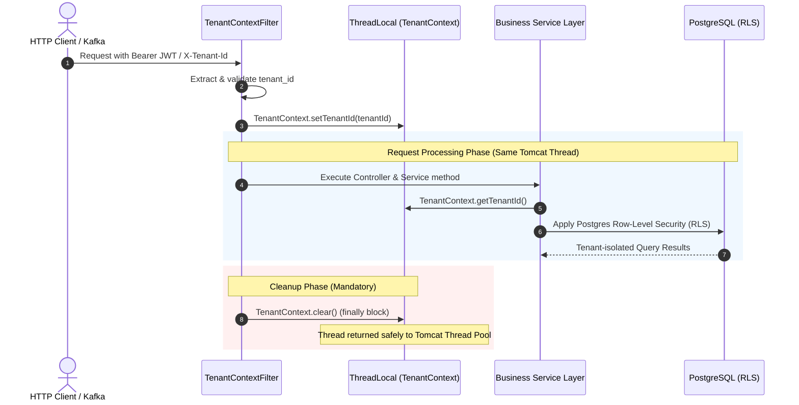

# ThreadLocal Usage & Architecture in CineBook

This document provides a comprehensive technical breakdown of **ThreadLocal** variable usage, lifecycle management, multi-tenancy context propagation, and memory safety practices in the **CineBook** platform.

---

## 🎯 Executive Summary & Purpose

In CineBook, **`ThreadLocal`** is the foundation for **Thread-Isolated Multi-Tenancy Context Propagation**. 

Because CineBook is a multi-tenant platform where multiple cinema organizations share the same backend microservices and database instances, every incoming request must execute under a strictly isolated `tenant_id` scope. `ThreadLocal` binds this tenant scope to the active execution thread handling the request.

---

## 🏛️ Core Architecture & Component Mechanics



---

## 🔑 Why `ThreadLocal` is Used in CineBook

### 1. 🏢 Multi-Tenant Data Isolation
When a web user or API client sends a request to CineBook, the embedded servlet container (Tomcat) assigns a dedicated worker thread to process that request. `ThreadLocal<String> tenantIdHolder` in [`TenantContext.java`](file:///d:/Development/CineBook_Development/cinebook-core-common/src/main/java/com/cinebook/common/core/security/TenantContext.java#L6) holds the tenant context exclusively for that specific worker thread.

### 2. 🧹 Eliminates Parameter Pollution
Without `ThreadLocal`, every single method across Controllers, Services, Repositories, Projections, and Interceptors would be forced to accept `String tenantId` as an explicit parameter:

```java
// ❌ WITHOUT ThreadLocal (Parameter Pollution across 500+ methods)
public BookingResponse createBooking(BookingRequest request, String userId, String tenantId) {
    bookingRepository.save(bookingEntity, tenantId);
}
```

With `ThreadLocal`, any component executing on the current thread fetches the tenant ID implicitly:

```java
// ✅ WITH ThreadLocal in CineBook
public BookingResponse createBooking(BookingRequest request, String userId) {
    String tenantId = TenantContext.getTenantId(); // Implicit fetch
    bookingRepository.save(bookingEntity);
}
```

### 3. 🛡️ Dynamic PostgreSQL Row-Level Security (RLS)
PostgreSQL schemas enforce tenant isolation at the database level (`WHERE tenant_id = current_setting('app.tenant_id', true)`). 

Before executing database operations, the persistence layer reads `TenantContext.getTenantId()` from the active thread and sets the session configuration in PostgreSQL.

### 4. 🏷️ Diagnostic MDC Logging Correlation
`ThreadLocal` synchronizes with SLF4J / Logback Mapped Diagnostic Context (`MDCFilter`), causing every log line emitted by the thread to automatically format diagnostic metadata:

```text
2026-08-07 13:40:25 INFO [http-nio-8086-exec-3] KeycloakAdminClientService : Creating user in Keycloak: user@email.com [tenant_id=550e8400-e29b...]
```

---

## 🛡️ Thread Pooling & Memory Leak Prevention

In web containers like Tomcat, worker threads are **reused from a thread pool** rather than destroyed after each request.

If a `ThreadLocal` variable is not cleared when a request finishes:
1. **Thread Context Leak (Data Pollution)**: Next request handled by the recycled thread might inherit the previous tenant's ID.
2. **Memory Leak**: Strong references held inside `ThreadLocalMap` prevent Garbage Collection of class loaders and thread scope objects.

### CineBook Protection Mechanism
CineBook strictly wraps all `ThreadLocal` mutations in `try-finally` blocks via [`TenantContextFilter.java`](file:///d:/Development/CineBook_Development/cinebook-core-common/src/main/java/com/cinebook/common/core/security/TenantContextFilter.java#L74-L80) and Kafka event consumers:

```java
try {
    // 1. Set ThreadLocal tenant context at request start
    TenantContext.setTenantId(tenantId);
    
    // 2. Process downstream application filter chain
    filterChain.doFilter(request, response);
} finally {
    // 3. MANDATORY CLEANUP: Remove thread variable before returning thread to pool
    TenantContext.clear();
}
```

---

## 📂 Source Code References

| File Name | Location | Primary Purpose |
| :--- | :--- | :--- |
| [`TenantContext.java`](file:///d:/Development/CineBook_Development/cinebook-core-common/src/main/java/com/cinebook/common/core/security/TenantContext.java#L6) | `cinebook-core-common` | Contains static `ThreadLocal<String> tenantIdHolder` and accessor methods |
| [`TenantContextFilter.java`](file:///d:/Development/CineBook_Development/cinebook-core-common/src/main/java/com/cinebook/common/core/security/TenantContextFilter.java#L74) | `cinebook-core-common` | HTTP Filter managing `ThreadLocal` lifecycle (`setTenantId` & `clear` in `finally`) |
| [`NotificationConsumer.java`](file:///d:/Development/CineBook_Development/notification-service/src/main/java/com/cinebook/notificationservice/listener/NotificationConsumer.java#L354) | `notification-service` | Sets and clears `ThreadLocal` tenant context for Kafka message listener worker threads |
| [`PaymentOutboxScheduler.java`](file:///d:/Development/CineBook_Development/payment-service/src/main/java/com/cinebook/paymentservice/scheduler/PaymentOutboxScheduler.java#L38) | `payment-service` | Manages `ThreadLocal` context for scheduled background polling threads |
