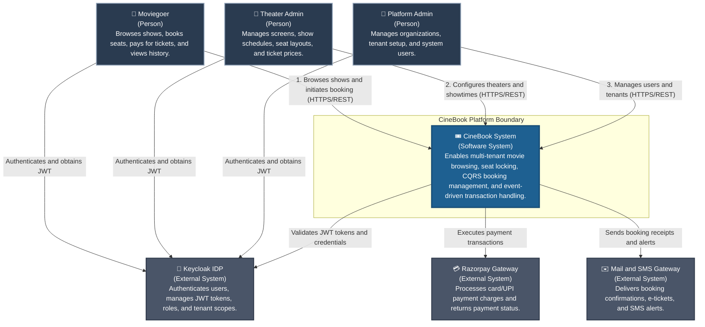
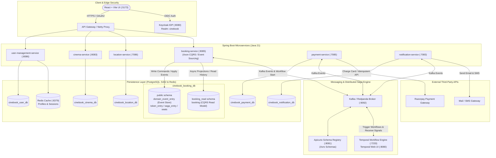
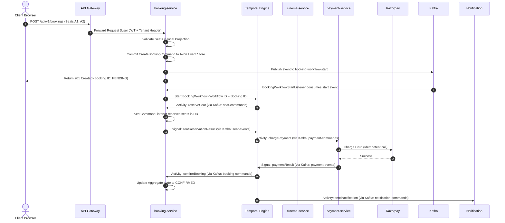
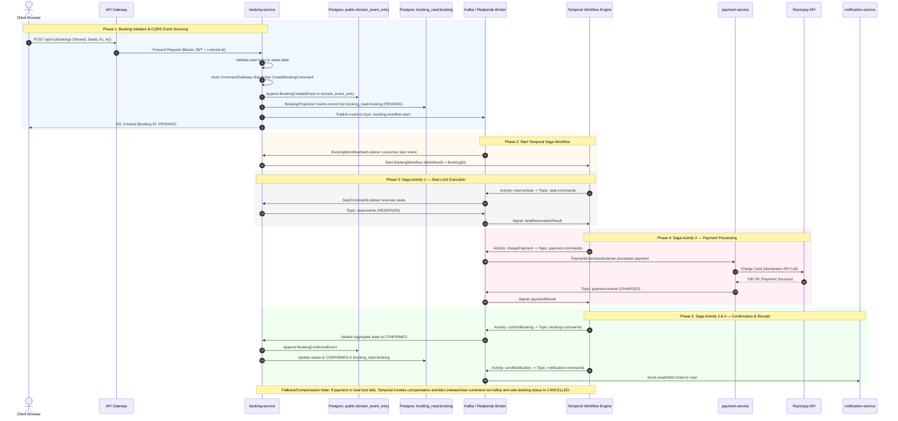

# CineBook Ticketing Platform: High-Level Design (HLD) Specification

This High-Level Design (HLD) document describes the macro-architectural structure, service containers, deployment topology, and integration data flows of the CineBook ticketing system.

---

## 1. C4 Model - Level 1: System Context Architecture Diagram

The System Context diagram illustrates the system boundaries of CineBook, detailing external actors and integrations.

---

## 2. C4 Model - Level 2: Container Architecture Diagram

The Container diagram decomposes the CineBook system into individual runtime containers, databases, and message brokers, showing their communication protocols.

---

## 3. High-Level Checkout Integration Sequence Diagram

This sequence diagram illustrates how separate services coordinate using Temporal to fulfill a ticket purchase transaction.

---

## E2E Ticket Booking Saga Sequence Diagram

---

## 4. Infrastructure & Deployment Architecture Diagram

CineBook runs on a **local Docker Desktop Kubernetes cluster**. Microservices are deployed via Helm charts, while all infrastructure components (Kafka, PostgreSQL, Keycloak, Temporal, etc.) run in Docker Compose and are accessible to Kubernetes pods via `host.docker.internal`.

```mermaid
graph TD
    Frontend[Frontend - npm run dev] -->|port-forward| K8s

    subgraph Docker Desktop Kubernetes
        K8s[Kubernetes Cluster]
        K8s --> UMS[user-management-service :8086]
        K8s --> CS[cinema-service :8083]
        K8s --> BS[booking-service :8085]
        K8s --> PS[payment-service :7085]
        K8s --> NS[notification-service :7083]
        K8s --> LS[location-service :7086]
    end

    subgraph Docker Compose Infra - host.docker.internal
        PG[(PostgreSQL :5432)]
        Kafka[Kafka :9092]
        KC[Keycloak :8080]
        Temporal2[Temporal :7233]
        Axon[Axon Server :8124]
        Redis2[Redis :6379]
        Apicurio[Apicurio Schema Registry :8081]
    end

    K8s -->|host.docker.internal| PG
    K8s -->|host.docker.internal| Kafka
    K8s -->|host.docker.internal| KC
    K8s -->|host.docker.internal| Temporal2
    K8s -->|host.docker.internal| Axon
    K8s -->|host.docker.internal| Redis2
    K8s -->|host.docker.internal| Apicurio
```

---

## 5. Security & Boundary Architecture

1. **Identity Verification**:
   * **Keycloak** (v24) is the OIDC identity provider, realm: `cinebook`.
   * Every microservice validates JWTs via Spring OAuth2 Resource Server (`spring.security.oauth2.resourceserver.jwt.*`).
   * `tenant-id` and `x-tenant-id` headers are propagated on every request and Kafka message for multi-tenancy isolation.

2. **Internal Network**:
   * Microservices communicate internally via Kubernetes ClusterIP services.
   * Services access the infra stack (Kafka, Postgres, etc.) via `host.docker.internal`.

3. **Secrets**:
   * Database passwords are stored in Kubernetes Secret `db-credentials`.
   * Keycloak admin credentials are configured in Docker Compose environment variables.
